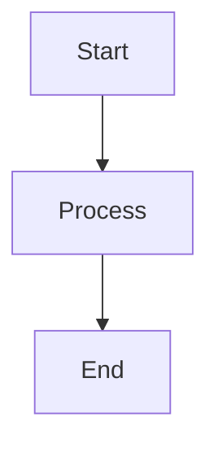

# GitBook.com 部署指南

## 方法一：通过 GitHub 同步（推荐）

### 步骤 1：创建 GitHub 仓库

```bash
# 在本地初始化 Git 仓库
cd paimon-gitbook
git init
git add .
git commit -m "Initial commit: Paimon Finance documentation"

# 在 GitHub 上创建仓库后推送
git remote add origin https://github.com/YOUR_USERNAME/paimon-docs.git
git branch -M main
git push -u origin main
```

### 步骤 2：连接 GitBook.com

1. 访问 [GitBook.com](https://www.gitbook.com/) 并登录/注册
2. 点击 **"New Space"** 创建新空间
3. 选择 **"Import"** → **"GitHub"**
4. 授权 GitBook 访问你的 GitHub 账户
5. 选择刚才创建的仓库 `paimon-docs`
6. GitBook 会自动同步并构建文档

### 步骤 3：配置自定义域名（可选）

1. 在 GitBook 空间设置中找到 **"Custom Domain"**
2. 添加你的域名（如 `docs.paimon.finance`）
3. 在 DNS 中添加 CNAME 记录指向 GitBook 提供的地址

---

## 方法二：直接在 GitBook.com 编辑

1. 在 GitBook.com 创建新空间
2. 手动将各文件内容复制到 GitBook 编辑器
3. 使用 GitBook 的可视化编辑器进行调整

---

## 目录结构说明

```
paimon-gitbook/
├── SUMMARY.md          # 目录结构（GitBook 必需）
├── README.md           # 首页
├── book.json           # GitBook 配置
├── .gitignore          # Git 忽略文件
├── styles/
│   └── website.css     # 自定义样式
├── overview/
│   ├── README.md       # Executive Summary
│   └── problem-definition.md
├── architecture/
│   ├── README.md       # System Architecture
│   ├── launchpad.md
│   ├── prime-vault.md
│   ├── redemption-mechanism.md
│   └── protection-band.md
├── products/
│   ├── README.md       # Tranche Vault
│   └── dex-strategy.md
├── governance/
│   ├── README.md       # Governance Structure
│   ├── tokenomics.md   # Token Economics
│   └── amp-system.md
├── risk-and-transparency/
│   ├── README.md       # Risk Disclosure
│   └── observability.md
├── roadmap.md
└── appendix/
    ├── glossary.md
    └── core-modules.md
```

---

## 注意事项

### LaTeX 公式
GitBook.com 原生支持 MathJax，公式使用 `$$...$$` 格式：
```markdown
$$
\mathrm{NAV}_t=\frac{V_{\text{assets}}-V_{\text{liabilities}}}{S_{\text{PPT}}}
$$
```

### Mermaid 图表
GitBook.com 支持 Mermaid 图表，使用代码块：
```markdown

```

### 内部链接
使用相对路径：
```markdown
[Link Text](../folder/file.md)
```

---

## 常见问题

### Q: 公式不显示？
A: 确保 book.json 中启用了 mathjax 插件，或在 GitBook.com 设置中启用数学公式支持。

### Q: 目录不更新？
A: 检查 SUMMARY.md 格式是否正确，确保缩进使用空格而非 Tab。

### Q: 图片不显示？
A: 将图片放在 `images/` 文件夹，使用相对路径引用。

---

## 联系方式

如有问题，请通过以下方式联系：
- GitHub Issues
- Discord
- Twitter @PaimonFinance
